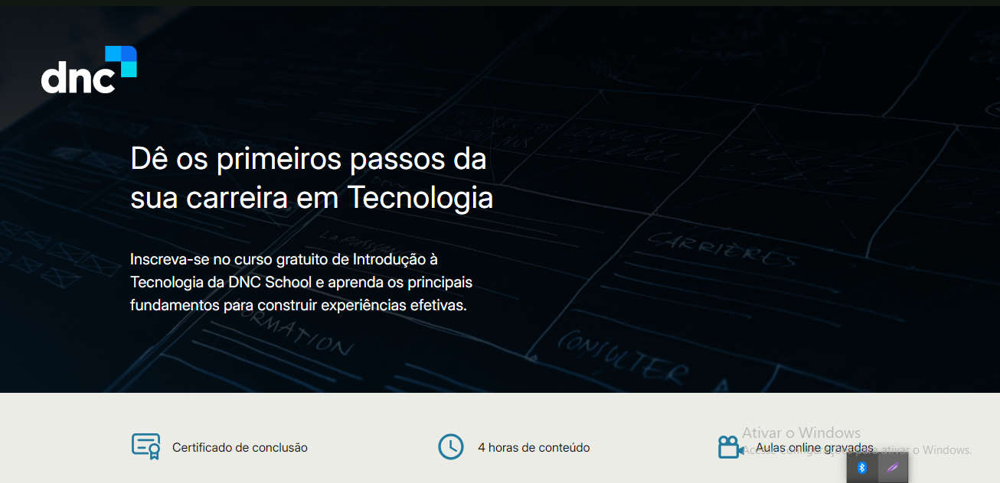

[JAVASCRIPT__BADGE]: https://img.shields.io/badge/javascript-%23323330.svg?style=for-the-badge&logo=javascript&logoColor=%23F7DF1E
[HTML__BADGE]: https://img.shields.io/badge/html5-%23E34F26.svg?style=for-the-badge&logo=html5&logoColor=white
[CSS__BADGE]: https://img.shields.io/badge/css3-%231572B6.svg?style=for-the-badge&logo=css3&logoColor=white
[PROJECT__BADGE]: https://img.shields.io/badge/📱Visite_esse_projeto-000?style=for-the-badge&logo=project
[PROJECT__URL]: https://myfirstlandingpage-gc.netlify.app/
[CHROME__URL]: https://www.google.com/chrome/dr/download/?brand=YTUH&ds_kid=43700077650614090&gad_source=1&gclid=Cj0KCQjwurS3BhCGARIsADdUH5167jbbhYJtsY6F3AVT8rrObpLIpiVZWD8Zy84x6tT5wKDHwt2-lRYaAo-7EALw_wcB&gclsrc=aw.ds 
[FIREFOX__URL]: https://mozilla-firefox.softonic.com.br
[OPERA__URL]: https://www.opera.com/pt-br/download

<h1 align="center" style="font-weight: bold;">Landing Page 💻</h1>


![javascript][JAVASCRIPT__BADGE]
![HTML5][HTML__BADGE]
![CSS3][CSS__BADGE]

<p align="center">
 <a href="#Sobre">Sobre</a> • 
 <a href="#started">Instruções de Uso</a> • 
</p>


<p align="center">
    
</p>

<h2 id="started">📌 Sobre</h2>

Esta landing page foi desenvolvida como parte do curso de Introdução à Tecnologia da DNC School, com o objetivo de apresentar o curso e incentivar novos alunos a se inscreverem. Com um design responsivo e moderno, a página utiliza HTML, CSS e JavaScript para oferecer uma experiência atraente e interativa. 

Os visitantes encontram informações sobre o curso, benefícios destacados em colunas, um vídeo explicativo sobre o processo de desenvolvimento, e um carrossel de depoimentos de alunos. Um formulário simples permite que os interessados capturem informações para acessar a ementa do curso. O uso de Grid e Flexbox garante uma organização eficiente, enquanto transições suaves e efeitos de hover melhoram a interatividade. No futuro, planejo adicionar validação ao formulário e aprimorar a responsividade para dispositivos móveis.

[![project][PROJECT__BADGE]][PROJECT__URL]

<h2 id="started">🚀 Instruções de Uso</h2>

Aqui você discobrirá como rodar esse projeto localmente

<h3>Pré-requisitos</h3>

Aqui estão listados todos os pré-requisitos necessários para rodar meu projeto. Por exemplo:

- Um browser de sua prefêrencia ( Ex: [Chrome][CHROME__URL], [FireFox][FIREFOX__URL], [Opera][OPERA__URL]...)
- [Git](https://github.com)

<h3>Clonando para sua máquina</h3>

Como clonar esse projeto:

```bash
git clone https://github.com/CristaldoGui/my-first-landing-page
```

<h3>Rodando</h3>

Como rodar esse projeto?

1 - Clique com o botão direito no arquivo Index.html <br>
2 - Seleciona a opção "Abrir com..." ou "Open with..." <br>
3 - Escolha o browser de sua preferência
